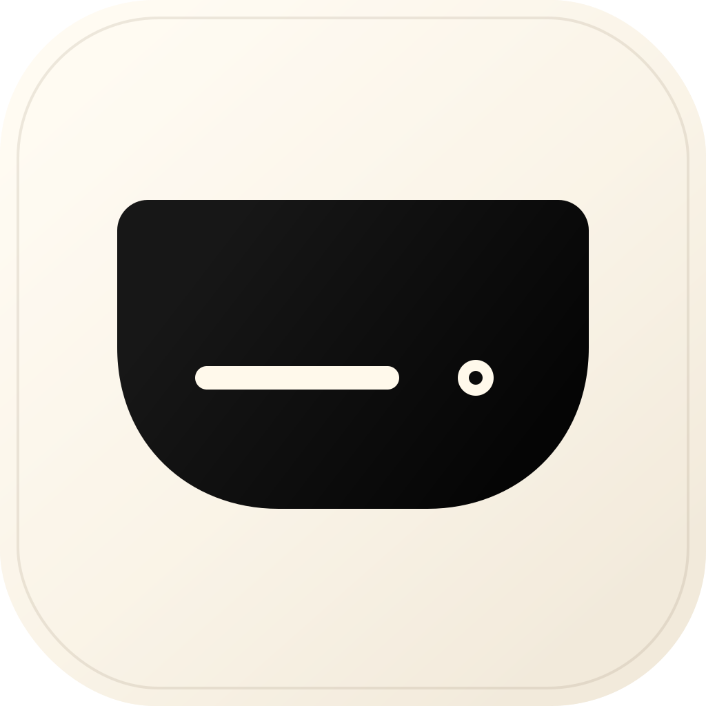

<div align="center">

# CodexNotch



### Codex 额度，始终在眼前。

**把周额度、精确重置时间和任务状态，固定在 MacBook 刘海旁。**<br>
切到浏览器、IDE 或任何其他应用，额度仍然一眼可见。

[](https://github.com/fengdwx/codex-notch/releases/latest)
[](Package.swift)
[](https://github.com/fengdwx/codex-notch/releases/latest)
[](LICENSE)

[**下载最新版**](https://github.com/fengdwx/codex-notch/releases/latest) · [**观看 26 秒中文演示**](docs/assets/codex-notch-demo-zh.mp4) · [English](README.md)

</div>

[](docs/assets/codex-notch-demo-zh.mp4)

<p align="center"><sub>真实 App 演示：周额度、精确重置时间、全部重置额度到期时间、跨应用持续可见，以及任务运行状态。</sub></p>

## 为什么做 CodexNotch

Codex 的额度很容易被其他窗口挡住。CodexNotch 把最关心的三个答案固定在 MacBook 刘海旁：

- **周额度还剩多少？**
- **到底几点几分几秒重置？**
- **任务现在还在运行吗？**

无论你在写代码、查资料还是处理其他工作，都不用切回 Codex 查看。

> **看一眼刘海：剩余额度、重置时间和任务状态，全都知道。**

## 一眼看懂

| 你关心的 | CodexNotch 怎么展示 |
| --- | --- |
| **额度还剩多少** | 刘海右侧用圆环或波浪球持续显示周额度，数字始终在指标内部。 |
| **什么时候重置** | 展开卡片直接显示精确重置时刻和秒级倒计时。 |
| **多次重置分别何时到期** | 点击“可重置 N 次”，一次展开全部重置额度的到期时间与剩余倒计时。 |
| **切到其他应用会不会消失** | 不会。浏览器、IDE 或其他应用在前台时，额度和状态仍在刘海旁。 |
| **任务有没有在跑** | 运行时显示蓝色状态回声；完成后切换为绿色对号。 |

## 核心体验

### 额度始终在眼前

即使没有任务正在运行，周额度指标也会一直保留在实体刘海旁。切到浏览器、IDE 或其他应用，剩余百分比仍然可见。

### 不只显示百分比，还精确到重置秒数

悬停刘海即可展开卡片，查看：

- 本周剩余额度与横向进度条
- 当前重置时刻与秒级倒计时
- 所有可用重置额度的精确到期时间
- 当前活动任务与最近对话

额度窗口根据接口返回的 `limit_window_seconds` 动态识别，不写死为 5 小时。

### 切换应用，额度还在

CodexNotch 是独立的原生 macOS 应用，不依赖 Atoll、CodexIsland、CC Switch 或其他宿主程序。你可以离开 Codex 窗口，额度、重置时间和任务状态仍然可见。

### 任务状态也在同一个位置

Codex 运行时显示蓝色状态回声，完成后切换为绿色对号。展开卡片中的任务可以直接打开 `codex://threads/<thread-id>`，不用重新寻找刚才的对话。

## 立即安装

前往 [**GitHub Releases**](https://github.com/fengdwx/codex-notch/releases/latest)，下载 `CodexNotch-...zip`：

1. 解压 ZIP。
2. 将 `CodexNotch.app` 拖入“应用程序”。
3. 登录 ChatGPT 并使用一次 Codex，然后启动 CodexNotch。

无需安装 Swift、Swift Package Manager 或 Xcode。

> 当前公开包默认使用 ad-hoc 签名。macOS 首次运行时可能提示无法验证开发者；请在“系统设置 → 隐私与安全性”中选择“仍要打开”，或右键应用后选择“打开”。

CodexNotch 默认读取 `~/.codex`。如果你的 Codex 使用其他目录，可通过 `CODEX_HOME` 指定。

## 自定义你看到的信息

鼠标移入实体刘海并点击右下角“设置”，或通过刘海右键菜单、应用菜单打开设置：

- 在顺时针额度圆环与波浪球之间切换
- 设置展开卡片显示的最近对话数量（1–5）
- 修改后立即生效，并保存在本机
- 开启 Reduce Motion 后保留静态状态，减少动态效果

无刘海屏幕会自动使用菜单栏 fallback。

<details>
<summary><strong>视觉与交互细节</strong></summary>

- 左右紧凑指标使用相同的 24pt 对齐容器，避免图标下沉或被摄像头区域遮挡。
- 额度环从 12 点方向开始，按顺时针表达进度；额度不低于 20% 时为绿色，低于 20% 时为红色，数据缺失时为灰色。
- 只有任务运行时，额度渐变或波浪才会运动；空闲、完成或启用 Reduce Motion 时保持静止。
- 展开卡片只从紧凑岛体向下展开；收起后回收透明画布，避免拦截刘海外的鼠标操作。
- 数字始终显示在额度指标内部，不在旁边重复显示。

</details>

## 数据与隐私

- 认证令牌只从 `CODEX_HOME/auth.json` 读取并保存在进程内存，不写入 CodexNotch 缓存或日志。
- 额度与可用重置额度明细分别请求 ChatGPT 的只读 usage 和重置额度接口。
- 任务状态只解析本地 `CODEX_HOME/sessions` 中的 rollout JSONL 文件。
- 不记录 Authorization header、完整 usage 响应或用户消息正文。

usage 接口属于 ChatGPT 内部接口，字段未来可能变化。接口异常时会保留最后一次成功额度，任务监听仍会继续工作。

<details>
<summary><strong>从源码构建</strong></summary>

需要 macOS 14 或更高版本、Xcode 15 / Swift 5.9 或更新版本：

```sh
swift test
./scripts/build_app.sh
open dist/CodexNotch.app
```

生成可发布压缩包：

```sh
./scripts/release.sh
```

脚本会运行测试、构建 release `.app`、校验代码签名，并生成 ZIP 与 SHA-256 文件。只想跳过签名时可使用：

```sh
SIGN_IDENTITY=none ./scripts/build_app.sh
```

</details>

## 当前边界

CodexNotch 目前是 v1 preview，不提供终止 Codex 任务、成本统计、云同步、远程通知、宠物动画或 Mac App Store 分发。ChatGPT Classic 不属于监听目标。

## 开源许可

CodexNotch 使用 [MIT License](LICENSE)。如果它缓解了你的额度焦虑，欢迎点一个 Star。
